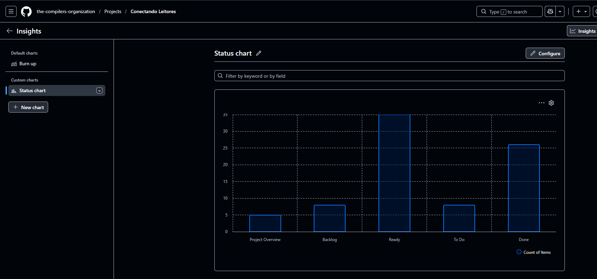
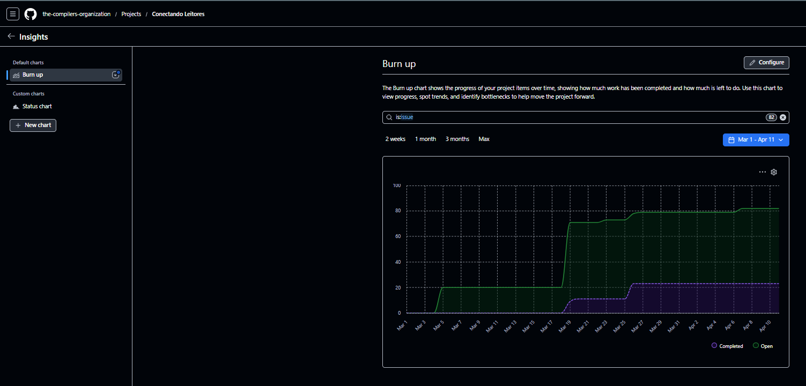

# 📊 Métricas e Análise de Desempenho – Conectando Leitores

📅 **Período analisado:** Sprint 1 e Sprint 2  
🎯 **Objetivo:** Avaliar produtividade, previsibilidade e evolução do projeto com base em métricas ágeis reais.

------------------------------------------------------------------------

## 1️⃣ Cálculo da Velocity

A Velocity foi calculada considerando **apenas histórias concluídas (Done)** ao final de cada Sprint.

### 🔹 Sprint 1
- Histórias concluídas: US00.1, US00.2  
- Story Points totais: **8**

### 🔹 Sprint 2
- Histórias concluídas: US00.3, US00.4  
- Story Points totais: **13**

### 📊 Resultado

| Sprint   | Story Points |
|---------|-------------|
| Sprint 1 | 8           |
| Sprint 2 | 13          |

👉 **Critério adotado:**  
Somente histórias com todos os critérios de aceitação atendidos (Definition of Done completo).

------------------------------------------------------------------------

## 2️⃣ Comparação entre Sprints

- Houve **aumento da Velocity (8 → 13)**  
- Indica evolução na produtividade da equipe  
- Melhor entendimento do processo ágil na Sprint 2  

### 📈 Interpretação

- Sprint 1 → foco em aprendizado e organização  
- Sprint 2 → maior eficiência e melhor execução  

👉 A equipe passou de um cenário inicial de adaptação para maior previsibilidade.

------------------------------------------------------------------------

## 3️⃣ Análise de Desempenho

### 🔎 Fatores que impactaram a Sprint 1

- Inexperiência com métodos ágeis  
- Dificuldade com GitHub Projects  
- Escrita inicial das histórias de usuário  
- Dúvidas na priorização  

### 🔎 Fatores que impactaram a Sprint 2

- Melhor divisão de tarefas  
- Backlog mais estruturado  
- Definição clara de requisitos não funcionais  
- Melhor organização técnica  

👉 Resultado: aumento de produtividade e melhor fluxo de trabalho.

------------------------------------------------------------------------

## 4️⃣ Evidências Visuais (GitHub Projects)

### 📊 Status Chart (Estado Atual do Board)

#### Interpretação:
- Alto número de itens em **Ready** → backlog refinado  
- Itens em **Done** → entregas realizadas  
- Itens em **To Do** → planejamento contínuo  

👉 Representa o estado atual do projeto.

------------------------------------------------------------------------

### 📈 Burn Up Chart (Evolução do Projeto)

#### Interpretação:

- Linha verde (**Open**) → crescimento do escopo  
- Linha roxa (**Completed**) → progresso das entregas  

Observações importantes:

- Aumento do backlog ao longo do tempo → inclusão de novas tarefas e ajustes  
- Crescimento gradual das entregas → progresso contínuo  
- Diferença entre linhas → trabalho ainda pendente  

👉 O gráfico evidencia evolução real e mudanças de escopo.

------------------------------------------------------------------------

## 🔄 Relação entre os Gráficos

- **Status Chart** → visão atual (snapshot)  
- **Burn Up Chart** → visão histórica (evolução)  

👉 Juntos, permitem análise completa do projeto.

------------------------------------------------------------------------

## 5️⃣ Ações de Melhoria

Com base na análise, a equipe definiu:

- Melhorar estimativas (Planning Poker)  
- Refinar histórias antes da Sprint  
- Manter atualização contínua do board  
- Acompanhar progresso diariamente  
- Priorizar validação de requisitos antes da implementação  

------------------------------------------------------------------------

## 📊 Conclusão

- A equipe apresentou evolução clara entre as Sprints  
- Houve aumento de produtividade (Velocity)  
- O uso de métricas permitiu identificar melhorias no processo  
- A análise foi baseada em dados reais do GitHub Projects  

👉 O projeto demonstrou maturidade crescente no uso de práticas ágeis.

------------------------------------------------------------------------

## 📌 Observação Final

Mesmo sem snapshots do Kanban por Sprint, a análise foi realizada com base em:

- Dados reais de entregas (Velocity)  
- Evolução do projeto (Burn Up Chart)  
- Estado atual do board (Status Chart)  
